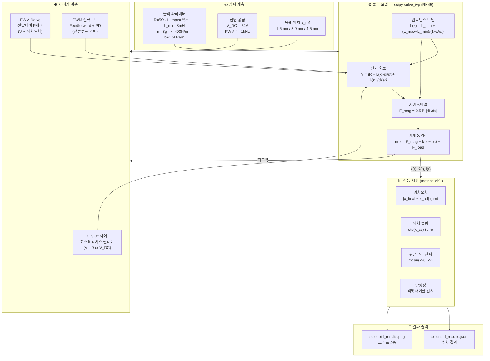
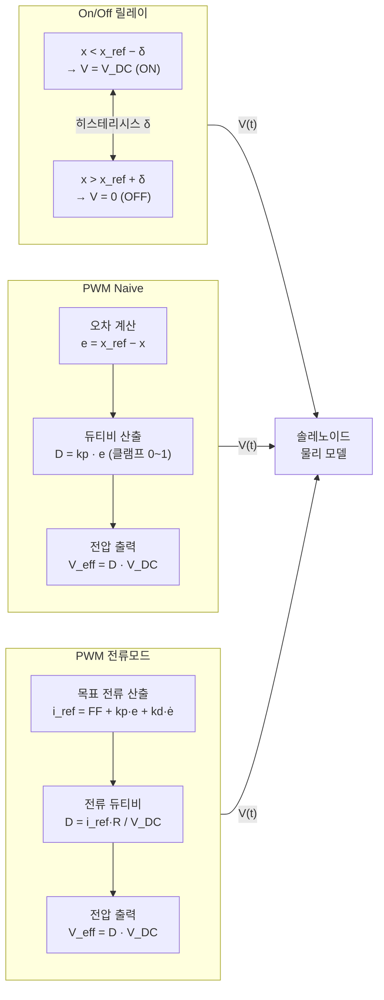
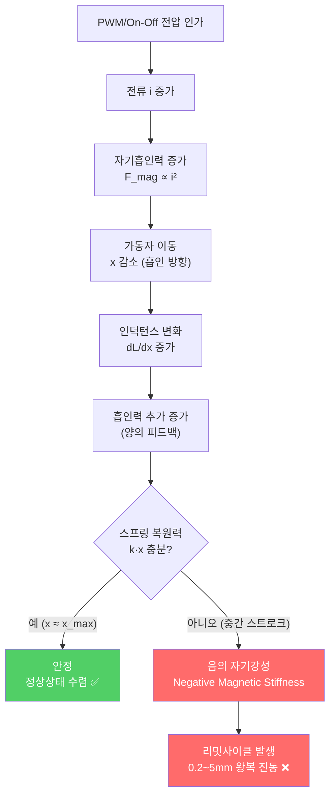
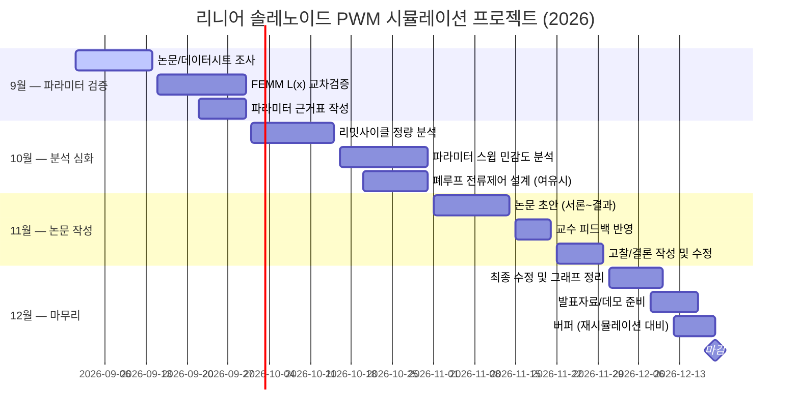

# 리니어 솔레노이드 PWM 제어 시뮬레이션 — 시스템 블록도

## 1. 전체 시스템 구조

```mermaid
flowchart TB
    subgraph INPUT["📥 입력 계층"]
        PARAM["물리 파라미터\nR=5Ω · L_max=25mH · L_min=8mH\nm=8g · k=400N/m · b=1.5N·s/m"]
        VDC["전원 공급\nV_DC = 24V\nPWM f = 1kHz"]
        TARGET["목표 위치 x_ref\n1.5mm / 3.0mm / 4.5mm"]
    end

    subgraph CTRL["🎛️ 제어기 계층"]
        C1["On/Off 제어\n히스테리시스 릴레이\n(V = 0 or V_DC)"]
        C2["PWM Naive\n전압비례 P제어\n(V ∝ 위치오차)"]
        C3["PWM 전류모드\nFeedforward + PD\n(전류루프 기반)"]
    end

    subgraph PHYS["⚙️ 물리 모델 — scipy solve_ivp (RK45)"]
        ELEC["전기 회로\nV = iR + L(x)·di/dt + i·(dL/dx)·ẋ"]
        IND["인덕턴스 모델\nL(x) = L_min + (L_max−L_min)/(1+x/x₀)"]
        MAG["자기흡인력\nF_mag = 0.5·i²·|dL/dx|"]
        MECH["기계 동역학\nm·ẍ = F_mag − k·x − b·ẋ − F_load"]
    end

    subgraph METRICS["📊 성능 지표 (metrics 함수)"]
        ERR["위치오차\n|x_final − x_ref| (μm)"]
        RIPPLE["위치 떨림\nstd(x_ss) (μm)"]
        POWER["평균 소비전력\nmean(V·i) (W)"]
        STAB["안정성\n리밋사이클 감지"]
    end

    subgraph OUTPUT["💾 결과 출력"]
        JSON["solenoid_results.json\n수치 결과"]
        PNG["solenoid_results.png\n그래프 4종"]
    end

    PARAM --> PHYS
    VDC --> CTRL
    TARGET --> CTRL
    C1 --> ELEC
    C2 --> ELEC
    C3 --> ELEC
    IND --> ELEC
    IND --> MAG
    ELEC --> MAG
    MAG --> MECH
    MECH -->|"x(t), ẋ(t), i(t)"| METRICS
    MECH -->|피드백| CTRL
    METRICS --> JSON & PNG
```

---

## 2. 제어기별 동작 흐름

```mermaid
flowchart LR
    subgraph ONOFF["On/Off 릴레이"]
        direction TB
        O1["x < x_ref − δ\n→ V = V_DC (ON)"]
        O2["x > x_ref + δ\n→ V = 0 (OFF)"]
        O1 <-->|히스테리시스 δ| O2
    end

    subgraph NAIVE["PWM Naive"]
        direction TB
        N1["오차 계산\ne = x_ref − x"]
        N2["듀티비 산출\nD = kp · e (클램프 0~1)"]
        N3["전압 출력\nV_eff = D · V_DC"]
        N1 --> N2 --> N3
    end

    subgraph CURRENT["PWM 전류모드"]
        direction TB
        I1["목표 전류 산출\ni_ref = FF + kp·e + kd·ė"]
        I2["전류 듀티비\nD = i_ref·R / V_DC"]
        I3["전압 출력\nV_eff = D · V_DC"]
        I1 --> I2 --> I3
    end

    ONOFF --> |"V(t)"| SIM["솔레노이드\n물리 모델"]
    NAIVE --> |"V(t)"| SIM
    CURRENT --> |"V(t)"| SIM
```

---

## 3. 핵심 발견 — 불안정성 메커니즘

```mermaid
flowchart TD
    A["PWM/On-Off 전압 인가"] --> B["전류 i 증가"]
    B --> C["자기흡인력 증가\nF_mag ∝ i²"]
    C --> D["가동자 이동\nx 감소 (흡인 방향)"]
    D --> E["인덕턴스 변화\ndL/dx 증가"]
    E --> F["흡인력 추가 증가\n(양의 피드백)"]
    F --> G{스프링 복원력\nk·x 충분?}
    G -->|"예 (x ≈ x_max)"| H["안정\n정상상태 수렴 ✅"]
    G -->|"아니오 (중간 스트로크)"| I["음의 자기강성\nNegative Magnetic Stiffness"]
    I --> J["리밋사이클 발생\n0.2~5mm 왕복 진동 ❌"]

    style I fill:#ff6b6b,color:#fff
    style J fill:#ff6b6b,color:#fff
    style H fill:#51cf66,color:#fff
```

---

## 4. 프로젝트 로드맵

```mermaid
gantt
    title 리니어 솔레노이드 PWM 시뮬레이션 프로젝트 (2026)
    dateFormat YYYY-MM-DD
    section 9월 — 파라미터 검증
        논문/데이터시트 조사          :active, p1, 2026-09-01, 2026-09-14
        FEMM L(x) 교차검증            :p2, 2026-09-15, 2026-09-30
        파라미터 근거표 작성          :p3, 2026-09-22, 2026-09-30
    section 10월 — 분석 심화
        리밋사이클 정량 분석          :a1, 2026-10-01, 2026-10-15
        파라미터 스윕 민감도 분석     :a2, 2026-10-16, 2026-10-31
        폐루프 전류제어 설계 (여유시) :a3, 2026-10-20, 2026-10-31
    section 11월 — 논문 작성
        논문 초안 (서론~결과)         :w1, 2026-11-01, 2026-11-14
        교수 피드백 반영              :w2, 2026-11-15, 2026-11-21
        고찰/결론 작성 및 수정        :w3, 2026-11-22, 2026-11-30
    section 12월 — 마무리
        최종 수정 및 그래프 정리      :f1, 2026-12-01, 2026-12-10
        발표자료/데모 준비            :f2, 2026-12-08, 2026-12-16
        버퍼 (재시뮬레이션 대비)      :f3, 2026-12-12, 2026-12-19
        마감                         :milestone, 2026-12-19, 0d
```
